# Hi, I'm Agustín 👋

Based in Buenos Aires, Argentina — into everything tech, computers, and IT in general.

---

### 🛠️ Tech Stack

**Languages**

**Frontend**

**Backend**

**Databases**

**DevOps & Infra**

**Tools & Platforms**

**Also exploring**

---

### 📌 Featured Project

**[discord-anti-scam-bot](https://github.com/aguu5/discord-anti-scam-bot)**

A Discord moderation bot built to catch the "compromised account sending fake celebrity crypto-casino screenshots" scam. It scores each message on four signals — suspicious text patterns, blocklisted/shortened links, perceptual image hashing against known scam screenshots, and account/behavior red flags — then alerts moderators or auto-removes the message once a threshold is crossed.

---

### 📊 GitHub Stats

---

💬 Always open to talking tech, tooling, and whatever I'm currently tinkering with.

